# QuanLyHanhChinh

Sử dụng PHP, MySQL tạo website quản lý quy trình đăng ký và duyệt nghỉ phép
#####  a. Tạo CSDL như sau

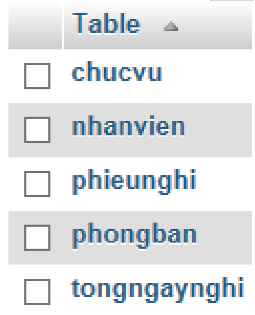

Trong đó các Tables như sau
- Phòng ban: Lưu thông tin các phòng ban

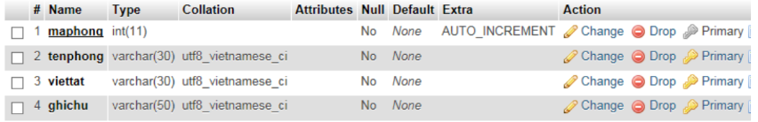

- Chức vụ: Lưu thông tin các chức vụ có thể có của nhân viên
  
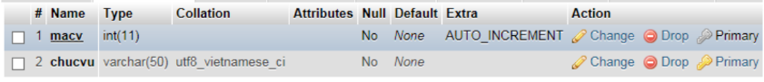

- Nhân viên: Lưu thông tin của một nhân viên
  
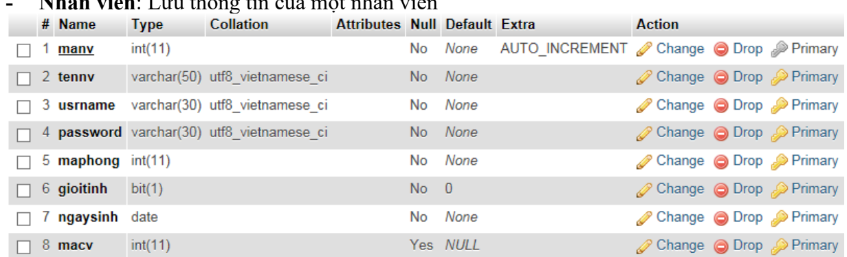

- Tổng ngày nghỉ: Lưu thông tin tổng số ngày nghỉ, số ngày đã nghỉ của một nhân
  viên trong từng năm
  
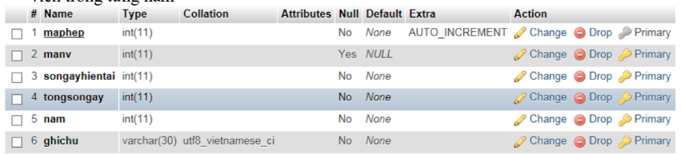

- Phiếu nghỉ: Lưu thông tin chi tiết 1 phiếu đăng ký nghỉ phép của nhân viên
  
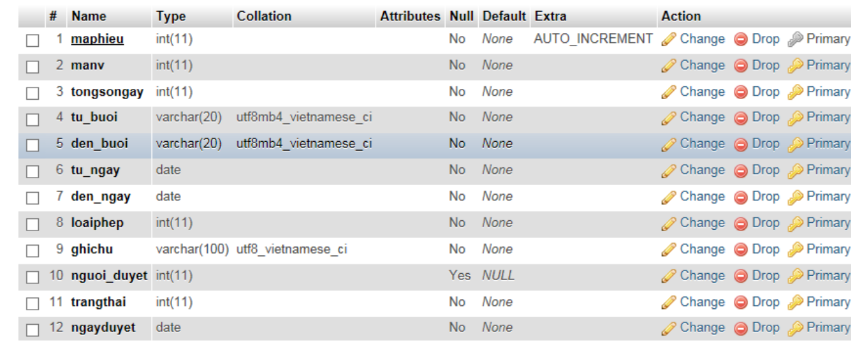

##### b. Tạo trang đăng nhập cho phép người dùng đăng nhập (user admin được tạo sẵn với chức vụ là admin có toàn quyền trên hệ thống)
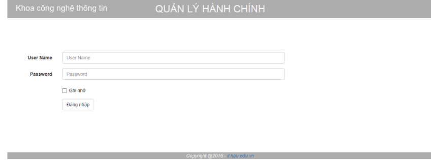
Nếu người đăng nhập với quyền là admin thì chuyển đến trang admin ( xem câu b)
Nếu người đăng nhập là nhân viên thì chuyển đến trang chủ (xem câu d)

##### c. Tạo trang web cho phép thêm mới: phòng ban, chức vụ, nhân viên. Chỉ nhân viên là admin mới có quyền này
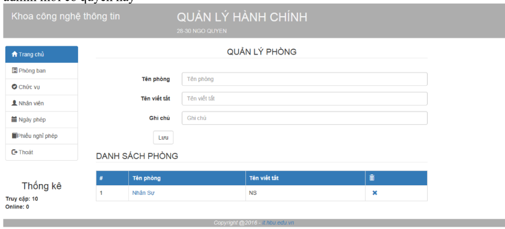

Người dùng click vào dấu x, cho phép xóa phòng được chọn

Người dùng click vào tên phòng, cho phép điền thông tin chi tiết vào khung quản lý
phòng cho cho phép lưu lại thông tin mới

• Quản lý nhân viên
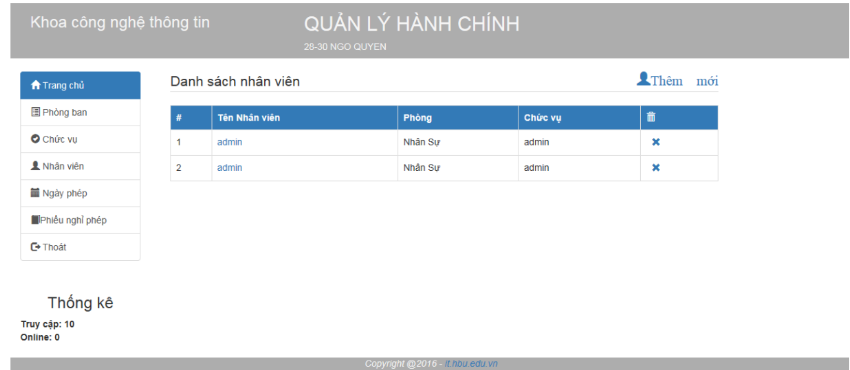

• Thêm mới nhân viên
  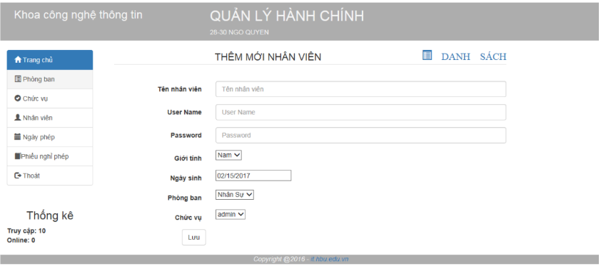

• Chức vụ
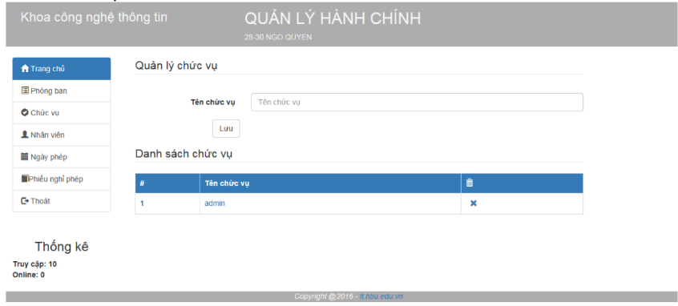

• Ngày phép nhân viên (xem số ngày phép của nhân viên trong năm, số ngày đã
nghỉ)
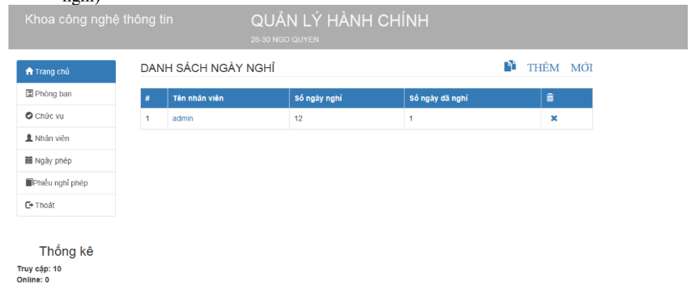

• Tạo mới tổng số ngày phép trong năm của một nhân viên
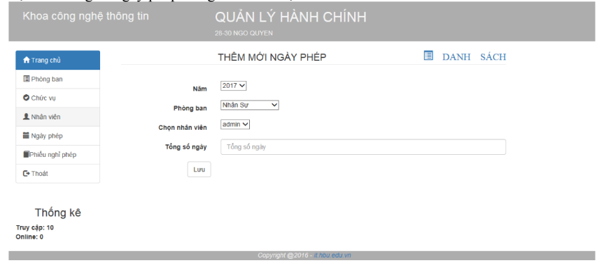

• Tạo phiếu nghỉ phép
Khi người dùng click vào “Phiếu nghỉ phép” chuyển đến trang tạo phiếu nghỉ
phép của người dùng đó ( xem câu e)
Người dùng click “Thoát”➔ trả về trang login.php
##### d. Tạo trang chính, trang chính liệt kê danh sách phiếu nghỉ phép trong 2 trường hợp:
- Người dùng là cấp quản lý:
  o Hiển thị danh sách các phiếu nghỉ của nhân viên trong phòng ban mình mà
  những phiếu này chưa được duyệt ( đang chờ duyệt)
  o Hiển thị danh sách các phiếu nghỉ phép của mình ( bao gồm tất cả trạng
  thái, sắp xếp theo trang thái)
- Nếu người dùng là cấp nhân viên:
  o Hiển thị danh sách các phiếu nghỉ phép của sắp xếp theo trạng thái (xem
  câu e )

##### e. Tạo trang web cho phép người dùng tạo phiếu nghỉ phép
Phiếu nghỉ phép được chuyển đến cho người quản lý trực tiếp

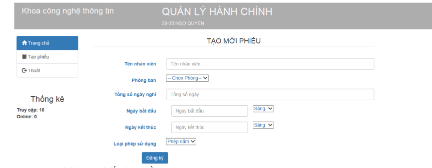
Các trạng thái của phiếu bao gồm:
Chờ duyệt
Đã duyệt
Từ chối
Có các loại nghỉ phép sau:
- Phép năm (0)
- Nghỉ bệnh (1)
- Nghỉ thai sản (2)
- Nghỉ việc riêng (3)
- Nghỉ không lương (4)
  Nếu tổng số ngày nghỉ ( số ngày hiện tại trên database) của nhân viên lớn hơn hoặc
  bằng tổng số ngày nghỉ được phép nghỉ trong năm của nhân viên thì chỉ cho phép
  chọn nghỉ không lương
  Nếu số ngày nghỉ trên db nhỏ hơn tổng ngày được nghỉ nhưng số ngày trên db + số
  ngày trên phiếu lớn hơn tổng số ngày cho phép thì không cho tạo phiếu (khi đó
  người dùng bắt buột tạo 2 phiếu riêng biệt)
#####  f. Tạo trang web cho phép cấp quản lý duyệt phiếu nghỉ phép của nhân viên
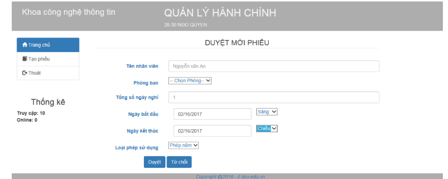
- Khi người quản lý duyệt phiếu nghỉ phép, số ngày đã nghỉ của nhân viên này tăng lên 1